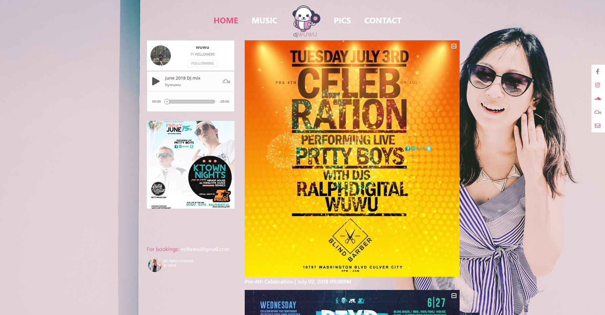
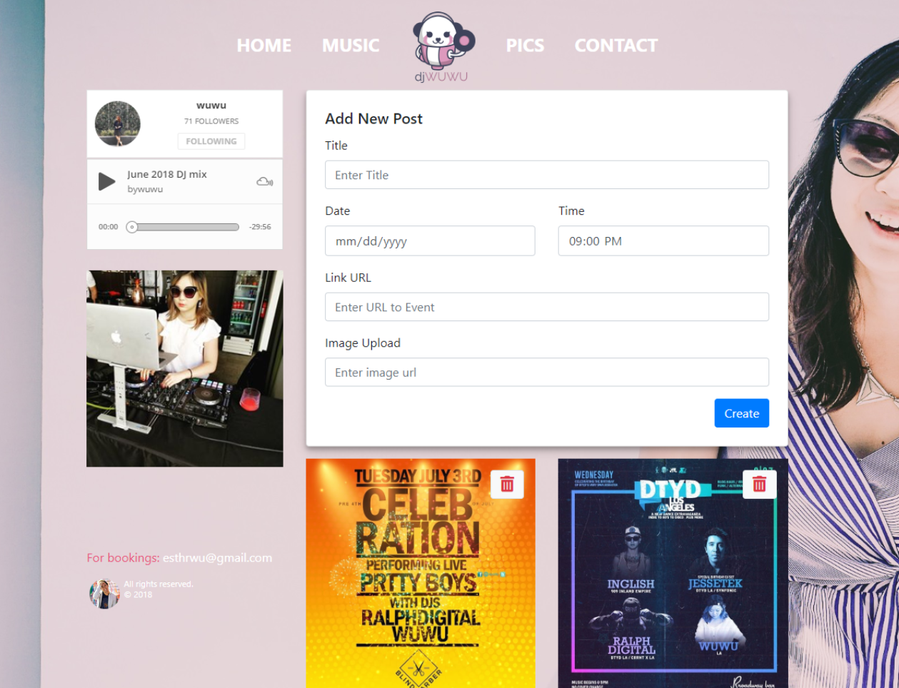
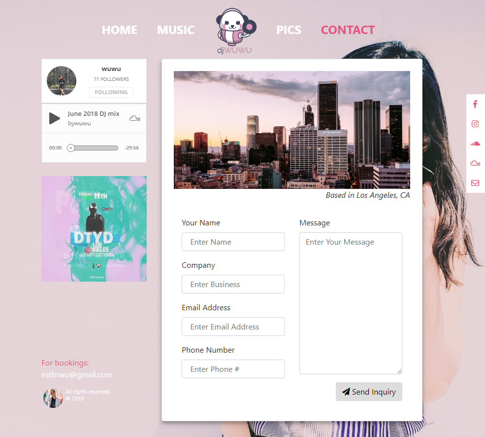
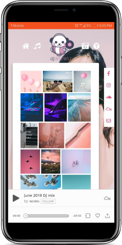

# djwuwu
DJ webpage using react-router and bootstrap 4 on the frontend and express, node.js, and mongoose on the back.

## Production
[djwuwu.com](https://djwuwu.com)

Responsive design:

Add and Delete Gigs:

Contact using nodemailer.js:

## Mobile design

## Built With
* [React](https://github.com/facebook/react)
* [Mongoose](https://github.com/Automattic/mongoose)
* [Express](https://github.com/expressjs) - Web Framework used
* [Bootstrap 4](https://getbootstrap.com/) - Frontend Stylings for mobile responsiveness
* [Node.js](https://github.com/nodejs/node)
* nodemailer

## Authors

* **David Lac** - [kiddmit3](https://github.com/kiddmit3)

&copy; 2018 David Lac

